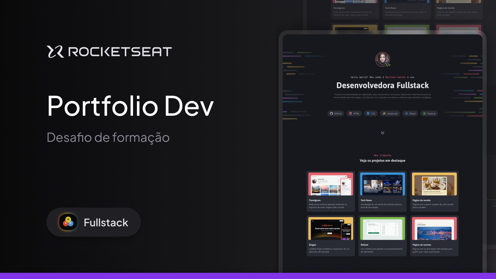

k# 💻 Portfólio Pessoal - Rocketseat Explorer

Este é o resultado do desafio prático do primeiro módulo da formação Explorer da Rocketseat. O objetivo foi colocar em prática conceitos fundamentais de **HTML** e **CSS**, utilizando técnicas de **Flexbox** e **CSS Grid** para criar um layout moderno e responsivo.

---

  

---

## 🚀 Sobre o Projeto

O projeto consiste em um portfólio pessoal que apresenta minha identidade como desenvolvedor, destacando minhas habilidades técnicas, serviços prestados e projetos principais.

### 🛠 Tecnologias Utilizadas

- **HTML5**: Estruturação semântica.
- **CSS3**: Estilização, layouts com Flexbox e Grid.
- **Google Fonts**: Tipografia personalizada.

---

## 📌 Seções do Portfólio

O desenvolvimento seguiu os seguintes requisitos técnicos:

1.  **Apresentação**: Seção com foto de perfil circular, mensagem de boas-vindas e uma breve introdução sobre minha trajetória.
2.  **Habilidades**: Exibição de tecnologias como **React**, **Tailwind CSS**, **NestJS** e **Shadcn** através de badges estilizadas.
3.  **Serviços**: Listagem de serviços oferecidos, como desenvolvimento Front-end e estruturação de APIs.
4.  **Projetos**: Card dinâmicos contendo imagem, título, descrição e as tags das tecnologias utilizadas em cada aplicação.
5.  **Contato**: Botões clicáveis para facilitar o networking.

---

## 👨‍💻 Um pouco sobre mim

Atualmente sou estudante de ciência da computação. Atuo como desenvolvedor Full Stack e busco constantemente evoluir minhas habilidades técnicas para alcançar o nível de Senior Staff Software Engineer. Tenho foco no ecossistema JavaScript, trabalhando tanto no Front-end quanto no Back-end.

---

## 📬 Contato

Sinta-se à vontade para entrar em contato comigo:

- **LinkedIn:** [Dantas](https://linkedin.com/in/danntas)
- **GitHub:** [gabr002](https://github.com/gabr002)
- **E-mail:** [gdantaslopes62@gmail.com](gdantaslopes62@gmail.com)

---

Feito com 💜 por [Dantas](https://linkedin.com/in/danntas)
